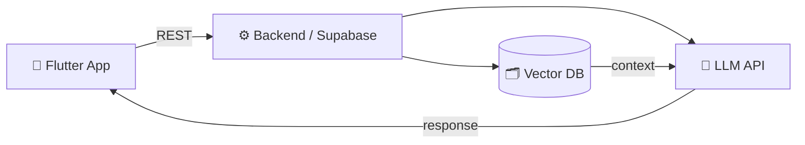

<h1 align="center">Hi 👋, I'm Himanshu (Hemi)</h1>
<h3 align="center">Flutter Developer → AI-Integrated Mobile Apps</h3>

  

  
  
  
  

  
  

---

## 🚀 About Me

- 📱 I build **cross-platform mobile apps** with **Flutter & Dart**, from idea to Play Store
- 🧠 I'm focused on bringing **AI/LLM features** into mobile products (chatbots, RAG, agentic flows)
- 🏗️ Full-stack mindset: mobile UI, state management, REST backends, and deployment
- 🌱 Currently learning: GenAI engineering, RAG pipelines, and React Native alongside Flutter
- 💬 Ask me about Flutter architecture, GetX, Supabase REST APIs, or LLM app integration

> [!NOTE]
> Open to freelance projects and junior/mid Flutter roles. Reach out via email or LinkedIn.

---

## 🧩 How I Build AI-Powered Apps

---

## 🛠️ Tech Stack

<b>📱 Mobile & Frontend</b>

 

<b>☁️ Backend & Cloud</b>

 

<b>🤖 AI / LLM</b>

 

<b>🧰 Languages & Tools</b>

 

---

## 📌 Featured Projects

| Project | What it is | Stack |
|---|---|---|
| **[Findify](https://github.com/himanshuSoni0516/findify)** | Lost-and-found mobile app | Flutter, Dart, Supabase |
| **[Blingify](https://github.com/himanshuSoni0516/blingify)** | Jewelry e-commerce app | Flutter, Dart, REST APIs |
| **[Rajsamand Express](https://github.com/himanshuSoni0516/rajsamand-express)** | Local news platform: website, admin panel, mobile app, custom backend | Flutter, Node.js |

<!-- Replace the repo links above with your real repository names. -->

---

## 📊 GitHub Stats

  <picture>
    <source media="(prefers-color-scheme: dark)" srcset="https://github-readme-stats.vercel.app/api?username=himanshuSoni0516&show_icons=true&theme=tokyonight&hide_border=true&bg_color=00000000" />
    <source media="(prefers-color-scheme: light)" srcset="https://github-readme-stats.vercel.app/api?username=himanshuSoni0516&show_icons=true&theme=default&hide_border=true&bg_color=00000000" />
    
  </picture>
  <picture>
    <source media="(prefers-color-scheme: dark)" srcset="https://github-readme-stats.vercel.app/api/top-langs/?username=himanshuSoni0516&layout=compact&theme=tokyonight&hide_border=true&bg_color=00000000" />
    <source media="(prefers-color-scheme: light)" srcset="https://github-readme-stats.vercel.app/api/top-langs/?username=himanshuSoni0516&layout=compact&theme=default&hide_border=true&bg_color=00000000" />
    
  </picture>

  

### 🐍 Contribution Snake

  <picture>
    <source media="(prefers-color-scheme: dark)" srcset="https://raw.githubusercontent.com/himanshuSoni0516/himanshuSoni0516/output/github-snake-dark.svg" />
    <source media="(prefers-color-scheme: light)" srcset="https://raw.githubusercontent.com/himanshuSoni0516/himanshuSoni0516/output/github-snake.svg" />
    
  </picture>

---

## 🤝 Let's Connect

  
  
  

<i>Building mobile experiences powered by AI, one widget at a time.</i>

